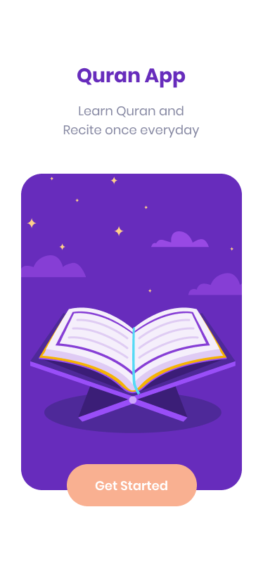
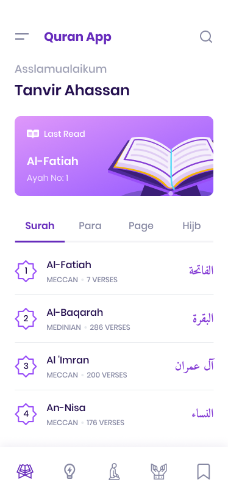
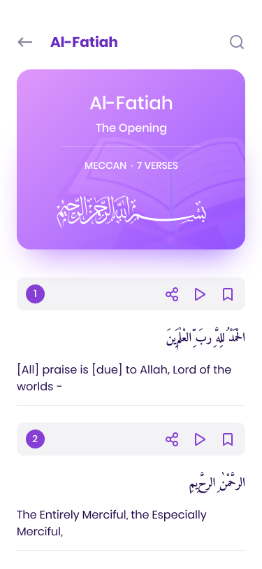
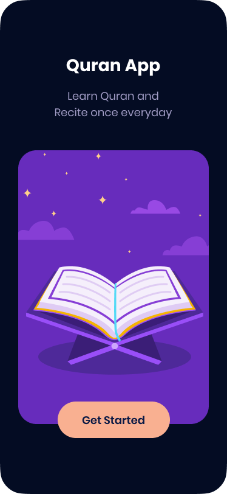
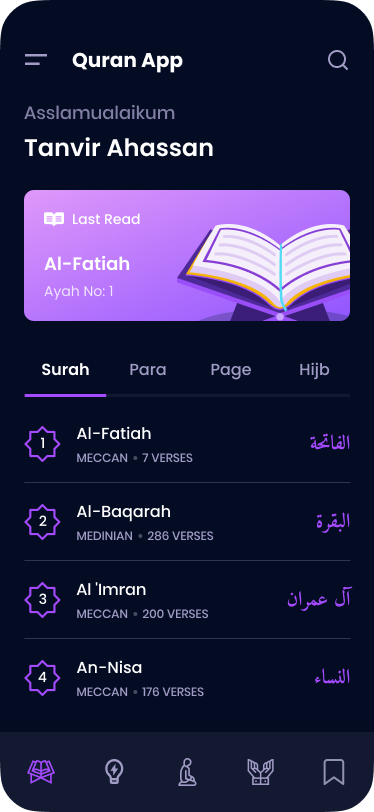
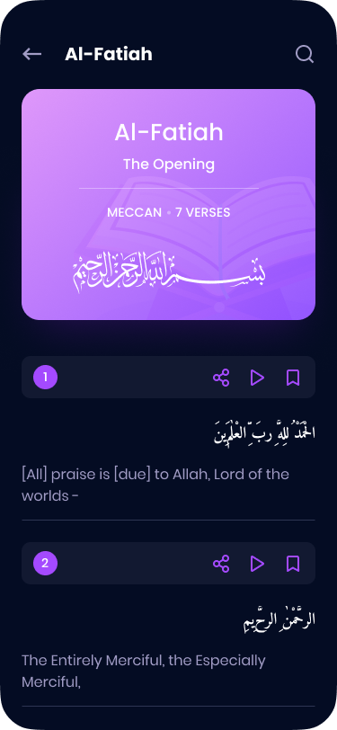

# Quran Concept App

Welcome to the Quran Concept App, a cutting-edge Flutter project designed to provide a seamless and immersive experience for exploring the Quran. This project incorporates modern Flutter architecture, follows MVVM design principles, and leverages state management through Singleton and Cubit.

## Screenshots

### Light Theme

  
  
  

### Dark Theme

  
  
  

<!-- Add more screenshots here -->

## Project Overview

### Features

- **Responsive UI:** The app ensures a consistent and appealing user interface across various screen sizes.
- **Dark and Light Themes:** Experience the Quran in your preferred visual setting with seamlessly integrated dark and light themes.
- **Native Splash Screen:** A native splash screen offers a polished and professional introduction to the Quran Concept experience.

### Tech Stack

- **Flutter:** Utilize the power of Flutter for cross-platform mobile development.
- **MVVM Architecture:** Follow the Model-View-ViewModel design pattern for a scalable and maintainable codebase.
- **State Management:** Implement state management with Singleton and Cubit to efficiently handle application state.
- **Networking:** Use Dio for efficient API requests, ensuring a smooth flow of data.
- **Data Layer:** Employ the Repository and Repository Implementation pattern for a solid and structured data layer.
- **SOLID Principles:** Adhere to SOLID principles to ensure a robust and scalable software architecture.

